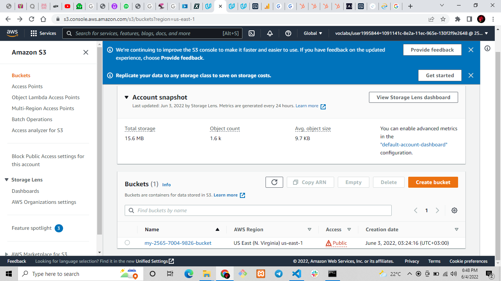
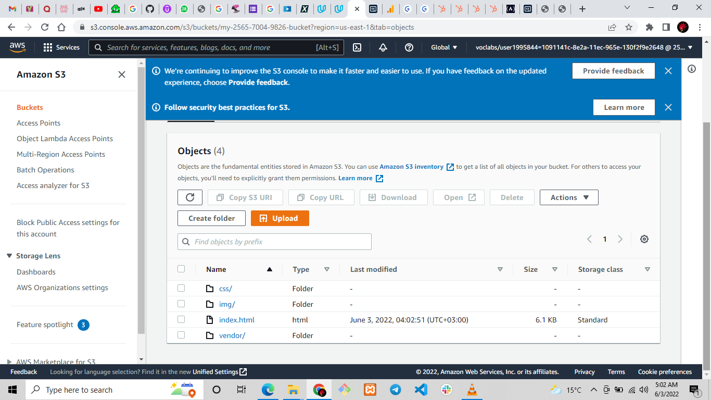
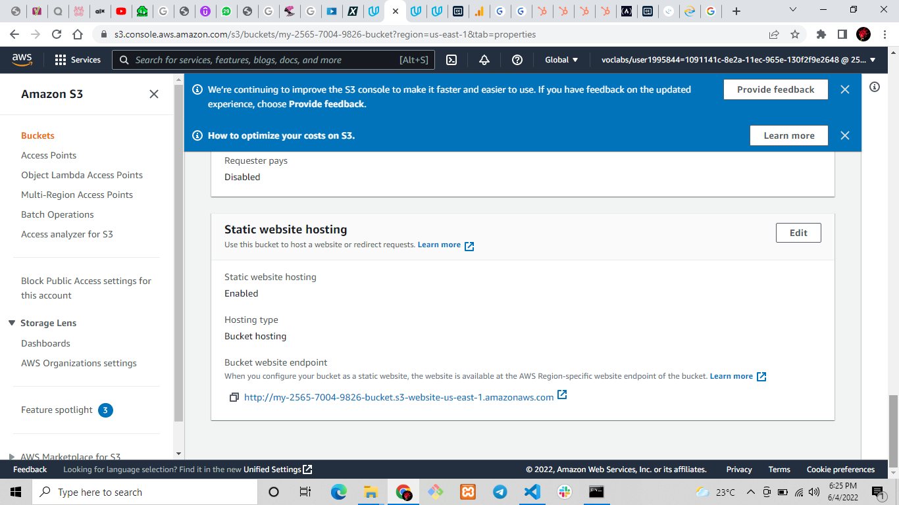
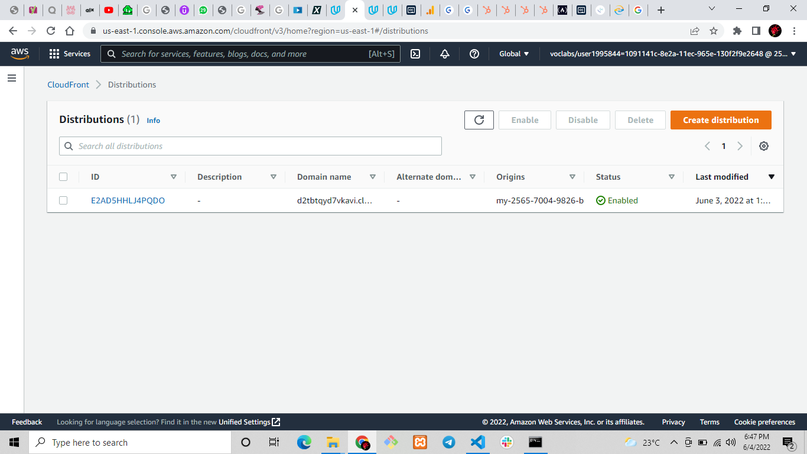

Deploy Static Website on AWS

In this project, you will deploy a static website to AWS using S3, CloudFront, and IAM.

The files included are: 

index.html - The Index document for the website.
/img - The background image file for the website.
/vendor - Bootssrap CSS framework, Font, and JavaScript libraries needed for the website to function.
/css - CSS files for the website.

** Links

- CloudFront
https://d2tbtqyd7vkavi.cloudfront.net/

- S3
http://my-2565-7004-9826-bucket.s3-website-us-east-1.amazonaws.com/

- IAM
http://my-2565-7004-9826-bucket.s3-website-us-east-1.amazonaws.com/index.html

**Website Files Screenshots

*** S3 bucket on AWS Management Console

*** Newly created S3

*** S3 configured to support static web hosting

*** Bucket policy

*** CloudFront has been configured to retrieve and distribute website files.

